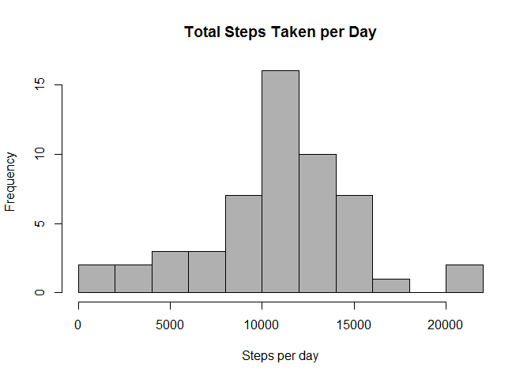
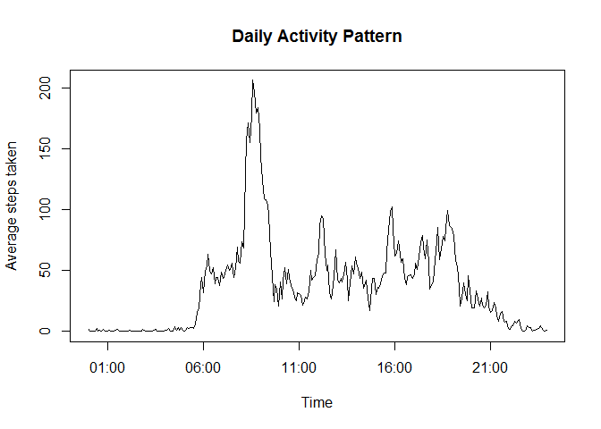
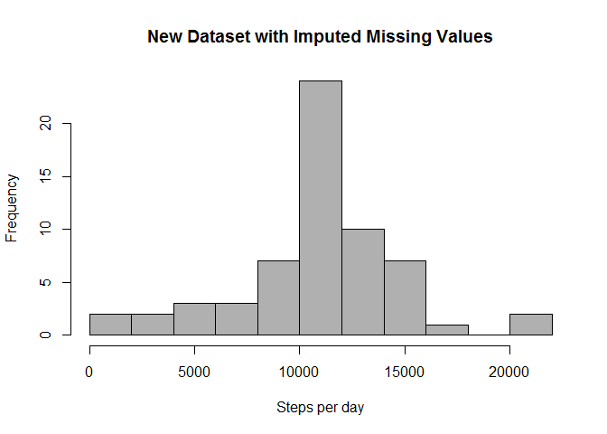
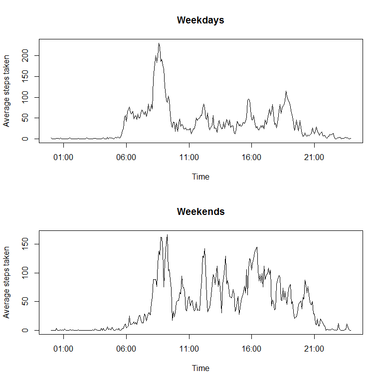

# Reproducible Research: Peer Assessment 1


## Loading and preprocessing the data
The first step was to simply load in the data

```r
data <- read.csv("activity.csv")
```
## What is mean total number of steps taken per day?
Here, the tapply function is used to calculate the average number of steps taken per day.

```r
tsteps <- tapply(data$steps,data$date,sum)
mean1 <- as.integer(mean(tsteps,na.rm=T),digits=5)
median1 <- as.integer(median(tsteps,na.rm=T),digits=5)
```
Thus, the mean and median steps taken per day were 10766 and 10765 respectively.

The following histogram displays the distribution of steps taken per day. 

```r
hist(tsteps,breaks=8,col="gray69",xlab="Steps per day",main="Total Steps Taken per Day")
```

 

## What is the average daily activity pattern?
Using the tapply function, the average steps taken per 5 minute time of day interval was taken over a two month period.

```r
time <- strptime(sprintf("%04d", as.numeric(as.character(data$interval))),format="%H%M")
time_unique <- unique(time)
avg <- tapply(data$steps,data$interval,mean,na.rm=T)
plot(time_unique,avg,type="l",main="Daily Activity Pattern",xlab="Time",ylab="Average steps taken")
```

 

```r
    # Time of day with highest average walking
    max_time <- strftime(subset(time_unique,avg==max(avg)),format= "%r")
```
The time at which the most steps were taken on average was at 08:35:00 AM.

## Imputing missing values
However, the above analysis does not factor in missing values. Thus, a new data frame was created (data2) where missing values were imputed based on the average steps taken at that given 5 minute interval over the two month period.

```r
avg_df <- data.frame(time_unique,avg)
mis_val <- sum(is.na(data$steps))
time_na<- subset(time,is.na(data$steps))
avg_na <- NULL
for(i in 1:2304) {
avg_na[i] <-  subset(avg_df$avg,avg_df$time_unique==time_na[i])
}
data2 <- data
data2$steps[is.na(data2$steps)] <- avg_na
```

To see how this compares, we can now view the distribution of the new dataset with respect to the total steps taken per day.

```r
    tsteps2 <- tapply(data2$steps,data2$date,sum)
    hist(tsteps2,breaks=8,col="gray69",xlab="Steps per day",main="New Dataset with Imputed Missing Values")
```

 


```r
    mean2 <- as.integer(mean(tsteps2,na.rm=T),digits=5)
    median2 <- as.integer(median(tsteps2,na.rm=T),digits=5)
```
In this dataset, the mean and median steps taken per day were 10766 and 10766 respectively.

## Are there differences in activity patterns between weekdays and weekends?
First, a new factor variable was added to the new dataset to classify the day as either a weekday or weekend.

```r
data2$date <- strptime(data2$date,format="%Y-%m-%d")
data2$day <- weekdays(data2$date)

weekday <- c("Monday","Tuesday","Wednesday","Thursday","Friday")
for (i in 1:17568) {
if(data2$day[i] %in% weekday) { data2$dayofweek[i] <- "weekday"}
else {data2$dayofweek[i] <- "weekend"}
}
```

Next, the daily activity pattern was visualized on weekdays and weekends sepearately.

```r
WD <- subset(data2,data2$dayofweek=="weekday")
avg_WD <- tapply(WD$steps,WD$interval,mean)

WE <- subset(data2,data2$dayofweek=="weekend")
avg_WE <- tapply(WE$steps,WE$interval,mean)

par(mfrow=c(2,1))
time_unique <- unique(time)
plot(time_unique,avg_WD,type="l",main="Weekdays",xlab="Time",ylab="Average steps taken")
plot(time_unique,avg_WE,type="l",main="Weekends",xlab="Time",ylab="Average steps taken")
```

 

